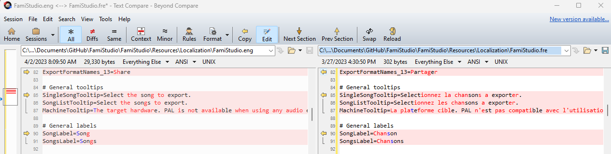

# FamiStudio Localization Guide
If you want to help localize FamiStudio, great, but please take a minute to read this guide.

# File format
All localization information is stored in this folder. There is 1 file per language. The format is basically a INI file, with UTF-8 encoding. 

The strings are stored in sections which are between brackets (ex: `[PianoRoll]`), which map to classes in the C# code.

In each section, you will find series of keys and values, separated by an equal (`=`) sign. You are only allowed to change the values, do not touch the keys.
Comments can be added with `#` or `;`. Everything to the right of these characters will be ignored.

If a string is missing or commented out in a particular language, it will always default to english.

```
[ConfigDialog]

# Title
Title=FamiStudio Configuration
Verb=Apply

# Sections
ConfigSectionNames_0=General
ConfigSectionNames_1=Interface
ConfigSectionNames_2=Input
ConfigSectionNames_3=Sound
ConfigSectionNames_4=Mixer
ConfigSectionNames_5=MIDI
ConfigSectionNames_6=FFmpeg
ConfigSectionNames_7=Keyboard
ConfigSectionNames_8=Mobile
```

Some strings may have parameters that will be inserted at run-time. Refer to the english version to see what they mean and place the parameters (`{0}`, `{1}`, etc.) where it makes sense gramatically.

```
EditEnvelopeTooltip=Edit {0} envelope
```

# General guidelines
Please follow these guidelines. Any PR/contribution that does not follow these will be rejected.

## Translate the whole app or don't do it at all
If you want to translate the app to a new language, I will require that you do a FULL translation, not just the feature you happen to use. You will need to go through every single string, dialog box, error message, etc. Make sure you have a grasp on every feature FamiStudio has and how to activate them.

## Be consistent
Multiple people may work on the same localization. It is important to be consistent to avoid confusing users. See what terms are already been used in other portions of the app and use those instead of coming up with new onces. For example, if the original author used the term "Square channel" instead of "Pulse channel", use that everywhere.

## Keep files aligned
Keep every all localization files perfectly aligned. This will make it easier to manage as the app changes. 
In other words:
- Do not reorder/add/delete strings
- Do not add/edit/remove whitespace
- Do not add/edit/remove comments
- Usage of a diff tool is strongly encouraged as it will make your life much easier.


## Test your stuff
Do not blindly translate without testing. In some cases, the UI doesnt adjust to the size of labels, so you will need to be sure they are not truncated. 
Be especially mindful of mobile, where space is limited. 

## Hotfix/Updates
When I add new string or rephrase existing ones, I will usually keep all other translations aligned and add a `#TODO!` comment next to the strings that requires your attention. Simply scan the file for these comments, translate, and remove the `#TODO!` when done. 


